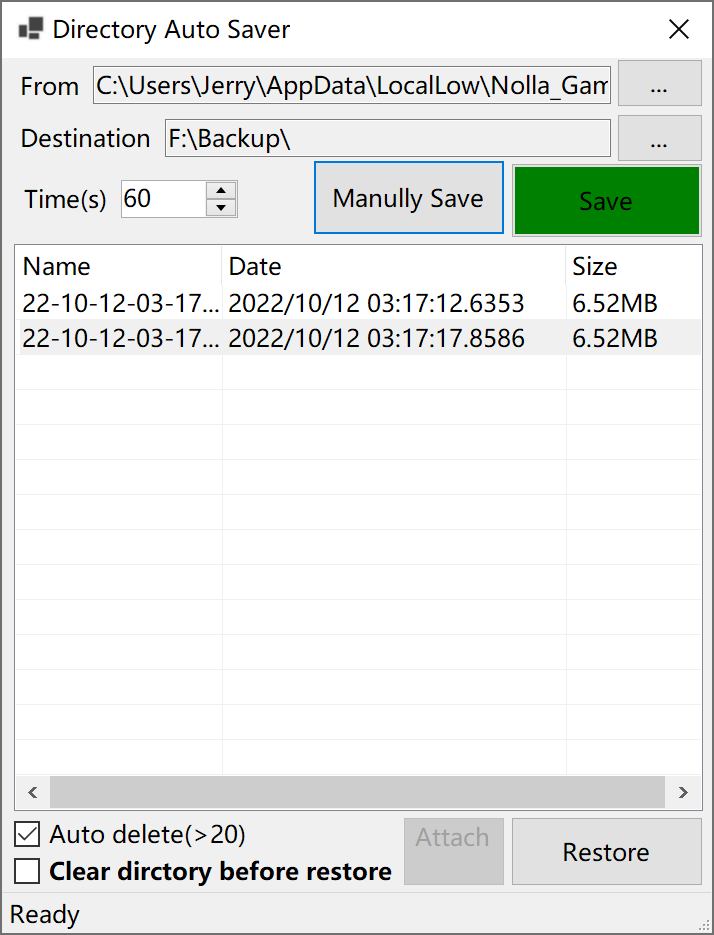

# SaveMyGame

一个即时文件保存工具。用于定时自动保存某文件夹的文件，并提供还原点可以一键还原。对于一命通关或者硬核游戏等不支持存档备份和还原点的游戏极为有用。

## 已经实现的功能

* 支持选择文件夹，自动打包压缩到指定文件夹进行备份
* 支持一键还原打包的备份文件到源文件夹
* 支持定时自动备份。
* 支持按照时间顺序自动删除旧文件防止备份文件过大

## 等待实现的功能

*您也可以在Discussion页提交您的建议*

* 监视某进程的启动和退出自动备份