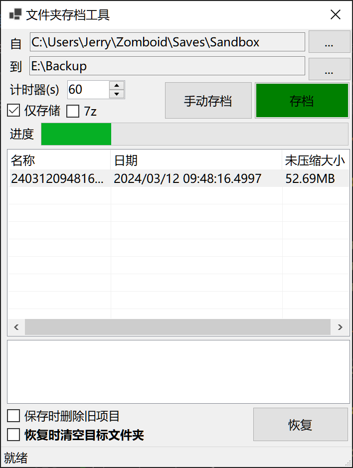

# SaveMyGame

一个即时文件保存工具。用于定时自动保存某文件夹的文件，并提供还原点可以一键还原。

对于一命通关或者硬核游戏等不支持存档备份和还原点的游戏极为有用。



## 已经实现的功能

* 支持选择文件夹，自动打包压缩到指定文件夹进行备份
  * 允许选择压缩等级（简易）如果包含了7z依赖，允许创建中等固实压缩包
  * 允许使用仅存储压缩等级

* 支持一键还原打包的备份文件到源文件夹（需要7z依赖）
  * ~~要依赖7z是因为懒得查询目标文件啥格式，无脑解压就行了。~~

* 支持定时自动备份。
* 支持按照时间顺序自动删除旧文件防止备份文件过大，默认将保留最新的10个文件
  * 目标文件夹过大时会提示

* 应用程序自动恢复上一次配置，并且存储存档位置、存档恢复位置等属性。
* ~~i18n支持~~
  * 未来可能会支持


## 构建和安装

使用下述指令发布（项目中已经包括了一个默认的发布选项）：

```
dotnet publish
```

~~C#的发布就是依托，作者表示目前暂时无法提供小文件、单文件的可执行文件，这一切都要怪C#这种奇怪的编译、链接选项，谢谢dotnet把我写的600行代码编译成一个带着260个文件的150MB的依托，谢谢dotnet把每行代码都演绎的淋漓尽致，对于一个只想写一个简单小程序的开发人员来说，C#真的不是一个好选择。还有你的AOT，不会写trim就别写，写出来WinForm不准用我真的麻了。~~

Release页面提供一个简单的多文件发布包，此包建议使用Installer安装到客户`CommonProgramFiles`里，然后使用快捷方式启动。~~为了眼不见心不烦~~。

